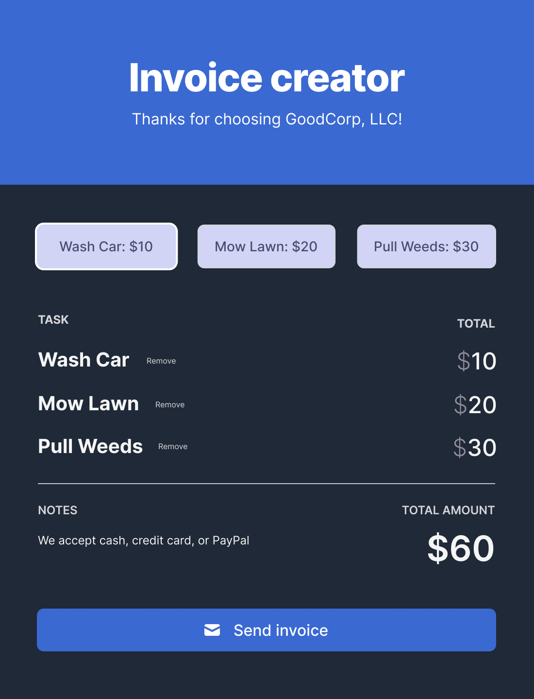

# Invoice Generator
Scrimba - Module 3 - Final Solo Project - Invoice Generator

This project was completed as part of the [Scrimba](https://scrimba.com/) [Frontend Career Path](https://scrimba.com/learn/frontend/) curriculum.

## Live Website

View the [live site]()

## Learning Goals

Implement a basic vanilla JavaScript application based on a list of specifications and a Figma design file.

## Core Requirements

- [ ] Array to hold services requested
- [ ] Buttons to add service to array
- [ ] Place to display data from array - updated every time the array changes
- [ ] Don't charge more than once for the same service
- [ ] Total cost stays updated
- [ ] Button to "send invoice" (reset)

## Stretch Requirements

- [ ] Remove items after adding

## Additional Personal Stretch Requirements

- [ ]

These are requirements I added to challenge myself further.
These come from noticing improvements that could be made while completing the core and stretch project requirements.

## Design

The design will be as per the the image below specified by the designer. See the complete [Figma project here](https://www.figma.com/file/roUn8DT7zHTI9tcL2JXNZG/Invoice-Generator?node-id=0%3A1).

## Author

Michael McGee [@m3t4m1k3](https://github.com/m3t4m1k3)

## TODO

- [ ]
